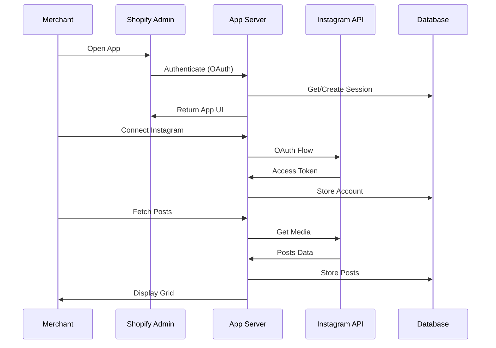

# Architecture

This document describes the system architecture and design of the Shopify Instafeed App.

## Technology Stack

| Layer | Technology | Version |
|-------|------------|---------|
| Framework | Remix | 2.7+ |
| UI Library | Shopify Polaris | 12.x |
| Database ORM | Prisma | 6.2+ |
| Build Tool | Vite | 5.1+ |
| Runtime | Node.js | 18.20+ / 20.10+ |
| Container | Docker | Multi-stage |

## Folder Structure

```
shopify-instafeed-app/
├── app/                          # Main application code
│   ├── components/               # Reusable React components
│   │   ├── AutoComplete.jsx      # Autocomplete input
│   │   ├── ModalGridComponent.jsx # Grid modal for posts
│   │   ├── SelectComponent.jsx   # Dropdown select
│   │   └── SkeletonCard.jsx      # Loading skeleton
│   ├── hooks/                    # Custom React hooks
│   │   └── useHydrated.jsx       # Client-side hydration hook
│   ├── routes/                   # Remix route handlers
│   │   ├── app._index.jsx        # Main dashboard (1770 lines)
│   │   ├── app.accounts.jsx      # Instagram accounts management
│   │   ├── app.plan.jsx          # Subscription management
│   │   ├── auth.*.jsx            # Authentication routes
│   │   ├── webhooks.*.jsx        # Webhook handlers
│   │   └── proxy.handler.jsx     # App proxy for storefront
│   ├── styles/                   # CSS stylesheets
│   ├── db.server.js              # Database helper functions
│   ├── shopify.server.js         # Shopify app configuration
│   └── root.jsx                  # Root layout component
├── extensions/                   # Shopify extensions
│   └── theme-extension/          # Theme app extension
│       ├── blocks/               # Theme blocks
│       │   └── instafeed.liquid  # Instagram feed block
│       ├── assets/               # Static assets (CSS, images)
│       ├── snippets/             # Reusable Liquid snippets
│       └── locales/              # Internationalization
├── prisma/                       # Database layer
│   ├── schema.prisma             # Database schema
│   └── migrations/               # Migration history
├── public/                       # Static public assets
├── Dockerfile                    # Production Docker config
├── docker-compose.yml            # Local Docker orchestration
├── shopify.app.toml              # Shopify app configuration
├── shopify.web.toml              # Web app configuration
├── vite.config.js                # Vite build configuration
└── package.json                  # Dependencies & scripts
```

## Request Flow



## Core Components

### 1. Shopify Server (`shopify.server.js`)
Central configuration for:
- API authentication
- Session storage (Prisma-backed)
- Billing configuration ($2/month)
- Webhook registration

### 2. Database Layer (`db.server.js`)
23 helper functions for:
- Instagram account CRUD
- Post management
- Product linking
- Subscription handling

### 3. App Proxy (`proxy.handler.jsx`)
Storefront endpoint at `/apps/instafeed` that:
- Retrieves selected posts
- Returns JSON for theme block
- Handles CORS

### 4. Theme Extension
Liquid block that:
- Fetches posts via app proxy
- Renders responsive grid
- Links to products

## Data Flow

```
┌─────────────────────────────────────────────────────────────┐
│                     SHOPIFY ADMIN                           │
├─────────────────────────────────────────────────────────────┤
│  ┌─────────────┐    ┌──────────────┐    ┌────────────────┐ │
│  │   OAuth     │───▶│   Session    │───▶│  App Routes    │ │
│  │   Flow      │    │   Storage    │    │  (Remix)       │ │
│  └─────────────┘    └──────────────┘    └────────────────┘ │
│                            │                     │          │
│                            ▼                     ▼          │
│                     ┌──────────────┐    ┌────────────────┐ │
│                     │   Prisma     │◀───│  Instagram     │ │
│                     │   Database   │    │  API Client    │ │
│                     └──────────────┘    └────────────────┘ │
└─────────────────────────────────────────────────────────────┘
                              │
                              ▼
┌─────────────────────────────────────────────────────────────┐
│                     STOREFRONT                              │
├─────────────────────────────────────────────────────────────┤
│  ┌─────────────┐    ┌──────────────┐    ┌────────────────┐ │
│  │   Theme     │───▶│   App        │───▶│   Instagram    │ │
│  │   Block     │    │   Proxy      │    │   Feed Grid    │ │
│  └─────────────┘    └──────────────┘    └────────────────┘ │
└─────────────────────────────────────────────────────────────┘
```

## Security Considerations

1. **Session Management**: Prisma-backed session storage with automatic expiry
2. **Webhook Verification**: HMAC validation on all webhook endpoints
3. **GDPR Compliance**: Full implementation of data request/deletion webhooks
4. **API Tokens**: Instagram tokens stored encrypted, with 60-day refresh handling
