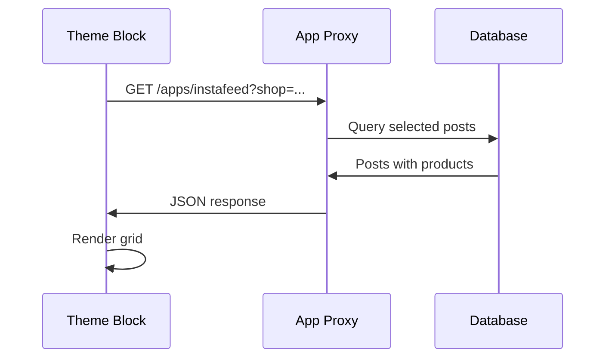

# Theme Extension

This document covers the theme app extension that displays Instagram feeds on merchant storefronts.

## Overview

The theme extension allows merchants to add an Instagram feed block to any section of their theme.

## Extension Structure

```
extensions/theme-extension/
├── shopify.extension.toml    # Extension configuration
├── blocks/
│   └── instafeed.liquid      # Main theme block
├── assets/
│   ├── instagram-feed.css    # Styles
│   └── thumbs-up.png         # Assets
├── snippets/                 # Reusable Liquid snippets
└── locales/
    └── en.default.json       # Translations
```

## Configuration

**`shopify.extension.toml`**:
```toml
name = "theme-extension"
uid = "65b30aae-2fc0-9b48-3e28-e6bf3e801b92f9c75ad7"
type = "theme"
```

## Theme Block

### `instafeed.liquid`

The main block that renders the Instagram feed on the storefront.

#### Features

- Fetches posts via app proxy
- Responsive grid layout
- Product linking overlay
- Lightbox for post viewing
- Configurable settings

#### Settings Schema

```liquid

{
  "name": "Instafeed",
  "target": "section",
  "settings": [
    {
      "type": "text",
      "id": "title",
      "label": "Title",
      "default": "Follow us on Instagram"
    },
    {
      "type": "range",
      "id": "columns",
      "label": "Columns",
      "min": 2,
      "max": 6,
      "default": 4
    },
    {
      "type": "range",
      "id": "rows",
      "label": "Rows",
      "min": 1,
      "max": 4,
      "default": 2
    },
    {
      "type": "checkbox",
      "id": "show_caption",
      "label": "Show captions",
      "default": true
    },
    {
      "type": "checkbox",
      "id": "show_products",
      "label": "Show linked products",
      "default": true
    }
  ]
}

```

#### Data Flow



#### Fetching Posts

```liquid
<script>
  document.addEventListener('DOMContentLoaded', async () => {
    const response = await fetch('/apps/instafeed');
    const data = await response.json();
    
    if (data.success) {
      renderFeed(data.posts);
    }
  });
</script>
```

---

## Styling

### `instagram-feed.css`

Provides responsive grid styling and hover effects.

#### Key Classes

| Class | Description |
|-------|-------------|
| `.instafeed-container` | Main wrapper |
| `.instafeed-grid` | Grid container |
| `.instafeed-item` | Individual post |
| `.instafeed-overlay` | Hover overlay |
| `.instafeed-products` | Product links |

#### Responsive Breakpoints

```css
/* Mobile */
@media (max-width: 480px) {
  .instafeed-grid {
    grid-template-columns: repeat(2, 1fr);
  }
}

/* Tablet */
@media (max-width: 768px) {
  .instafeed-grid {
    grid-template-columns: repeat(3, 1fr);
  }
}

/* Desktop */
@media (min-width: 769px) {
  .instafeed-grid {
    grid-template-columns: repeat(var(--columns, 4), 1fr);
  }
}
```

---

## Merchant Setup

### Adding the Block

1. Go to **Online Store > Themes**
2. Click **Customize** on active theme
3. Navigate to desired page/section
4. Click **Add block** or **Add section**
5. Select **Instafeed** under Apps

### Configuring Settings

| Setting | Description | Default |
|---------|-------------|---------|
| Title | Header text above feed | "Follow us on Instagram" |
| Columns | Grid columns (2-6) | 4 |
| Rows | Grid rows (1-4) | 2 |
| Show captions | Display post captions | Yes |
| Show products | Show linked products | Yes |

### Selecting Posts

From the app admin:
1. Go to dashboard
2. Select posts to display (checkbox)
3. Posts appear on storefront

---

## App Proxy Configuration

Defined in `shopify.app.toml`:

```toml
[app_proxy]
url = "https://instagramfeed-app.sprinix.com/proxy/handler"
subpath = "instafeed"
prefix = "apps"
```

**Result**: `https://store.myshopify.com/apps/instafeed`

---

## Development

### Testing Theme Block

1. Run dev server: `npm run dev`
2. Install app on development store
3. Add block to theme
4. Changes require extension re-deploy

### Deploying Extension

```bash
npm run deploy
```

This pushes theme extension changes to Shopify.

### Local Preview

Theme extensions can't be previewed locally. Use a development store.

---

## Customization

### Adding New Settings

1. Add to schema in `instafeed.liquid`:
```liquid
{
  "type": "color",
  "id": "overlay_color",
  "label": "Overlay color",
  "default": "#000000"
}
```

2. Use in template:
```liquid
<style>
  .instafeed-overlay {
    background-color: {{ block.settings.overlay_color | color_modify: 'alpha', 0.7 }};
  }
</style>
```

### Adding Translations

Update `locales/en.default.json`:
```json
{
  "blocks": {
    "instafeed": {
      "name": "Instagram Feed",
      "settings": {
        "title": {
          "label": "Title"
        }
      }
    }
  }
}
```

---

## Troubleshooting

| Issue | Solution |
|-------|----------|
| Block not showing | Verify app is installed and posts are selected |
| No posts loading | Check app proxy URL is correct |
| Styling broken | Ensure CSS file is loading |
| Products not showing | Verify products are linked in admin |
